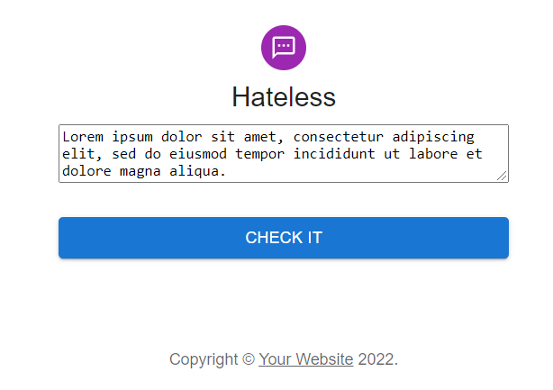

# Hateless demo

The api let its users to analyze the content of a text message. Result returned consists of the api's classification label for the text. There are three labels:

- Label '0' - `Hate speech`
- Label '1' - `Offensive speech`
- Label '2' - `Neither`

## Changelogs

This section keeps track of changes in this documentation

| Date           | Author       | Description    |
| -------------- | ------------ | -------------- |
| June 6th, 2022 | Nguyen (Jim) | README created |

A demo for Hateless webservice—see [Online DEMO](https://hateless.herokuapp.com)



## Specifications

### Overview

```txt
./demo
|---- README.md    // Project structures, specs, etc.
|---- web_api      // Backend sub-project
|---- web_app      // Frontend sub-project
|---- docs         // Engineering documentations
```

Two main components for project:

- Backend API
- Frontend web application

**Note:**

- Frontend web app is built and delivered by backend api at root
- To run the demo on your local, please re-create virtual environment with dependency listed in `web_api/requirements.txt` then execute the `wsgi.py` with the venv's Python
- To run the frontend only, change directory to `web_app/hateless` then run `npm run start`

### 1. Backend

- **Flask 2.0.2**: WSGI web application frame work [BSD License]
- **Gunicorn 20.1.0**: Also WSGI framework, but supports workers feature extension to **Flask** sequential request processing model
- **Scikit-learn**: ML library to load picked models by ML team (I picked )
  
### 2. Frontend

- **ReactJS 11.7.1**: JavaScript library for Web UI
- **MUI 5.2**: A React component library following Google's **Material UI**

#### Getting started
```txt
./demo/web_app/hateless
|---- package.json        // A manifest file, contains dependencies and operation cmds
|---- package-lock.json   // Auto-generated by npm, must be checked into source control
|---- public/             // Static files (default)
|---- src/                // Main source for React components
```

**Dependencies**

- react
- mui

**How to run**

Go to `./demo/web_app/hateless` directory (the one contains `package.json`). More React tutorials are available at [ReactJS official documentation](https://reactjs.org/docs/getting-started.html)

```
npm install       # npm installs dependencies and saves it to ./node_modules
npm run start     # react is built and deployed locally
```

### 3. Deployment plan

- Platform: Heroku
- Contacts:
  - Nguyen (Jim) - [nguyenng178@gmail.com](nguyenng178@gmail.com)
- Website: [Hateless Heroku app](https://hateless.herokuapp.com/)